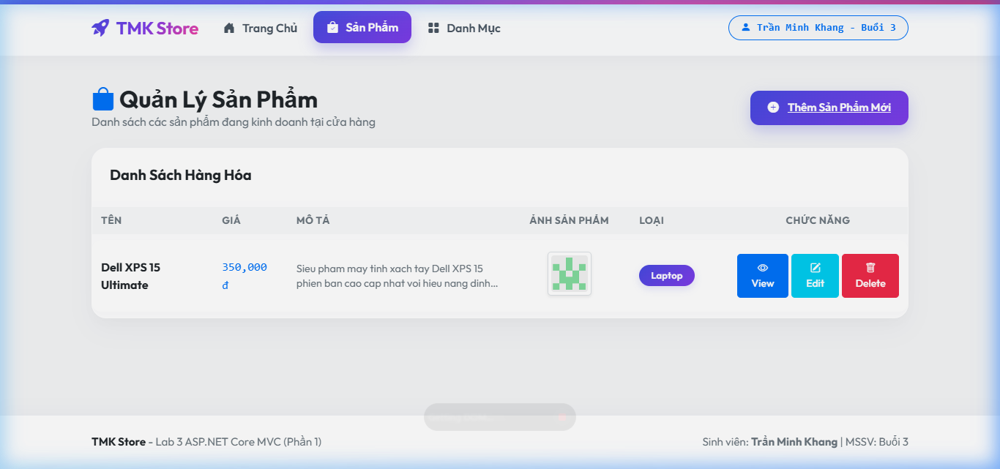
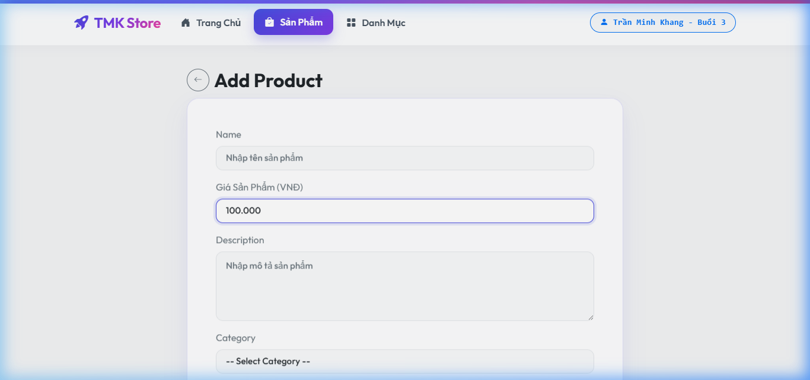
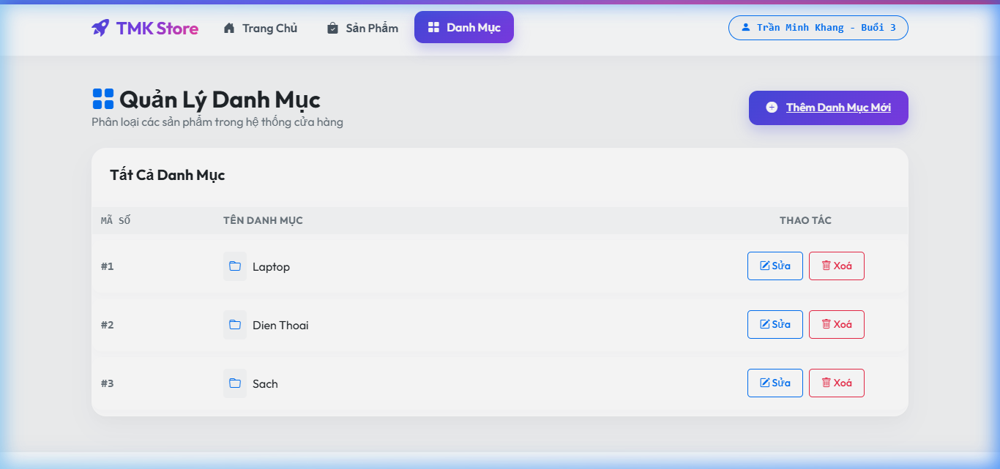
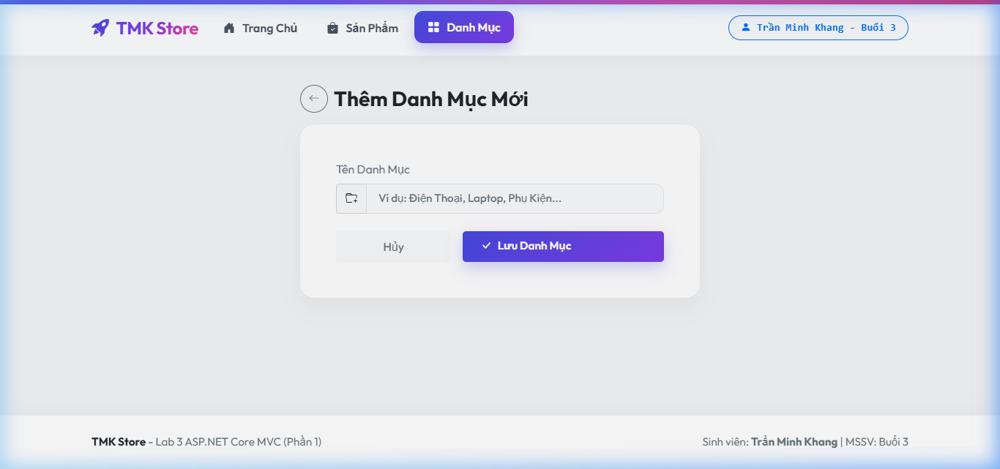

# 🌟 Lab 3 - ASP.NET Core MVC & EF Core: Hệ Thống Quản Lý Bán Hàng Premium (TMK Store)

Dự án này là bài thực hành **Lab 3** hoàn chỉnh của môn lập trình Web ASP.NET Core MVC kết hợp Entity Framework Core (EF Core) và cơ sở dữ liệu Microsoft SQL Server. Dự án được đầu tư thiết kế giao diện **Premium Gradient & Glassmorphism** cực kỳ bắt mắt và chuyên nghiệp.

## 📝 Thông Tin Sinh Viên
*   **Họ và tên**: Trần Minh Khang
*   **MSSV / Nhóm**: Buổi 3
*   **Tệp định danh dự án**: `HoTen_Buoi3.txt` & `TranMinhKhang_Buoi3.txt` (đã được tạo tại thư mục gốc của repo).

---

## ✨ Các Tính Năng Nổi Bật

1.  **Quản Lý Danh Mục (Category CRUD)**:
    *   Xem danh sách danh mục hiện đại dạng bảng bóng bẩy.
    *   Thêm mới, sửa đổi tên danh mục và xóa danh mục an toàn.
2.  **Quản Lý Sản Phẩm (Product CRUD)**:
    *   Danh mục sản phẩm được hiển thị trực quan dạng lưới bảng hiện đại kèm theo ảnh đại diện thumbnail, giá tiền và nhãn phân loại (badges).
    *   Tạo mới sản phẩm với tính năng tải lên hình ảnh (`wwwroot/images/`) lưu trực tiếp vào thư mục server.
    *   Chỉnh sửa sản phẩm có hỗ trợ thay đổi hình ảnh và xóa hình ảnh cũ tránh rác bộ nhớ server.
    *   Xem chi tiết thông số sản phẩm dạng Card Premium.
    *   Xóa sản phẩm kèm hộp thoại cảnh báo và tự động dọn dẹp tệp ảnh liên quan trên đĩa cứng.
3.  **Tự Động Định Dạng Tiền Tệ Hàng Nghìn (Auto-formatting Price Input)**:
    *   Khi người dùng nhập giá tiền (ví dụ `85000`), JavaScript sẽ tự động chèn dấu chấm phân cách hàng nghìn thành `85.000` theo thời gian thực.
    *   Hỗ trợ nạp dữ liệu cũ dạng chấm phân cách tự động khi sửa sản phẩm.
    *   Bắt lỗi giá trị và tự động lọc lấy số thuần túy để lưu vào database (không gây lỗi Model Binder của MVC).
    *   Mở rộng khoảng giá lên tối đa **10.000.000.000đ** phù hợp thị giá Việt Nam.
4.  **Live Image Preview**:
    *   Trang chỉnh sửa sản phẩm tích hợp tính năng xem trước ảnh trực tiếp ngay khi người dùng bấm chọn tệp ảnh mới mà không cần tải lại trang.

---

## 🎨 Ngôn Ngữ Thiết Kế Premium Gradient & Glassmorphism

*   **Font Chữ Hiện Đại**: Sử dụng Google Font **Outfit** mượt mà, bo tròn hiện đại và dễ đọc.
*   **Glassmorphism Navbar**: Thanh điều hướng có độ mờ kính mờ sương sang trọng (`backdrop-filter: blur(10px)`), viền trên là một dải gradient rực rỡ sắc màu cá tính (`#4f46e5`, `#7c3aed`, `#ec4899`, `#f43f5e`).
*   **Premium Gradients & Shadows**: Tiêu đề trang, thẻ Card và nút hành động sử dụng các dải gradient hiện đại, đổ bóng phát sáng êm dịu, phóng to nhẹ nhàng (`transform: translateY(-2px) scale(1.02)`) khi di chuột.

---

## 📸 Hình Ảnh Giao Diện Thực Tế Dự Án

### 1. Danh Sách Sản Phẩm (Product Catalog)
Giao diện hiển thị sản phẩm dạng lưới card hoặc table với ảnh sản phẩm sắc nét, badges danh mục hiện đại và hiệu ứng hover êm ái.


### 2. Thêm Sản Phẩm Mới & Định Dạng Giá Tiền Tự Động
Hộp thoại thêm mới sản phẩm tối giản, ô giá tiền tự động thêm dấu chấm ngăn cách hàng nghìn khi người dùng gõ số.


### 3. Danh Sách Danh Mục Sản Phẩm (Category Management)
Bảng hiển thị các danh mục hiện có cùng số lượng liên kết sản phẩm, bố cục gọn gàng, nút chỉnh sửa và xóa thiết kế tinh tế.


### 4. Thêm Danh Mục Mới
Giao diện card nhập liệu danh mục trực quan sắc nét.


---

## 🛠️ Hướng Dẫn Cài Đặt & Chạy Dự Án

### Yêu Cầu Hệ Thống
*   .NET 8.0 SDK
*   Microsoft SQL Server LocalDB hoặc SQL Server Express (`.\SQLEXPRESS`)

### Các Bước Thực Hiện
1.  **Clone dự án**:
    ```bash
    git clone https://github.com/khang1233/BaiTapLtWebBuoi3.git
    cd BaiTapLtWebBuoi3
    ```
2.  **Cấu hình Chuỗi Kết Nối**:
    Mở tệp `appsettings.json` và cấu hình lại chuỗi kết nối SQL Server Express của bạn:
    ```json
    "ConnectionStrings": {
      "DefaultConnection": "Server=.\\SQLEXPRESS;Database=TranMinhKhang_QuanLyBanHang;Trusted_Connection=True;MultipleActiveResultSets=true;TrustServerCertificate=True"
    }
    ```
3.  **Khởi tạo Database (Migrations & Database Update)**:
    ```bash
    dotnet ef database update
    ```
4.  **Chạy ứng dụng**:
    ```bash
    dotnet run
    ```
    Mở trình duyệt truy cập địa chỉ: [http://localhost:5249](http://localhost:5249) để kiểm thử và trải nghiệm giao diện!
